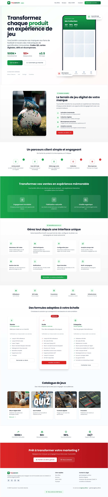

# VOID Challenge — Responsive UI Implementation

A frontend challenge for **VOID**, focused on transforming a provided **Figma UI/UX design** into a responsive, modern web page that works across different screen sizes.


## 📸 Preview

<div align="center">
  
</div>

## 🛠️ Technologies

* **React.js**
* **Vite**
* **Tailwind CSS**
* **JavaScript**
* **HTML5**
* **CSS3**

## ✨ Features

* 🎨 Pixel-focused implementation based on the provided Figma design
* 📱 Fully responsive layout
* 💻 Desktop, tablet, and mobile support
* ⚡ Fast development and build with Vite
* 🎯 Reusable React components
* 🎨 Styling with Tailwind CSS
* 🧩 Clean and organized component structure

## 📂 Project Structure

```text
void-challenge/
├── public/
├── src/
│   ├── assets/
│   ├── components/
│   ├── App.jsx
│   ├── main.jsx
│   └── index.css
├── package.json
├── vite.config.js
└── README.md
```

## ⚙️ Installation

Clone the repository:

```bash
git clone https://github.com/lotfiab1/VOID-Challenge.git
```

Navigate to the project:

```bash
cd VOID-Challenge
```

Install dependencies:

```bash
npm install
```

Start the development server:

```bash
npm run dev
```

The application will be available at the local URL displayed by Vite.

## 📦 Build for Production

```bash
npm run build
```

To preview the production build:

```bash
npm run preview
```

## 🌐 Deployment

The project is deployed using **Netlify**.

**Live:** [https://your-netlify-url.netlify.app](https://wondrous-croissant-a354a2.netlify.app/)

## 🎯 About the Challenge

This project was created as part of the **VOID Challenge**, with the goal of converting a Figma design into a responsive React implementation within a limited timeframe.

The challenge was a great opportunity to practice:

* Figma-to-code implementation
* Responsive design
* React component development
* Tailwind CSS
* UI accuracy
* Working under a time constraint

## 📚 What I Learned

During this challenge, I improved my experience with:

* Building responsive interfaces from Figma designs
* Structuring React applications into reusable components
* Using Tailwind CSS efficiently
* Handling responsive layouts for different devices
* Deploying React applications with Netlify
* Working efficiently within a short deadline

## 👨‍💻 Author

**Lotfi Ait Baaya**

* GitHub: https://github.com/lotfiab1
* Portfolio: https://lotfiab1.github.io/lotfi-protfolio/
* LinkedIn: https://www.linkedin.com/in/lotfiab1

---

⭐ If you find this project interesting, feel free to check out the repository and my other projects.


